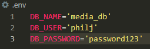
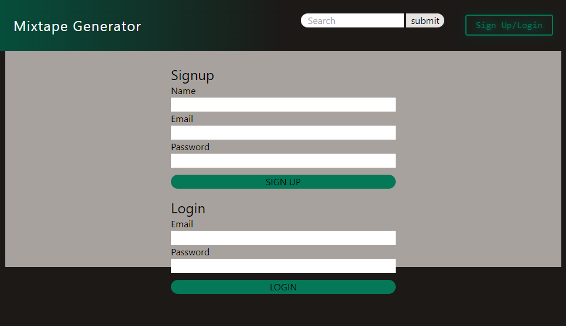
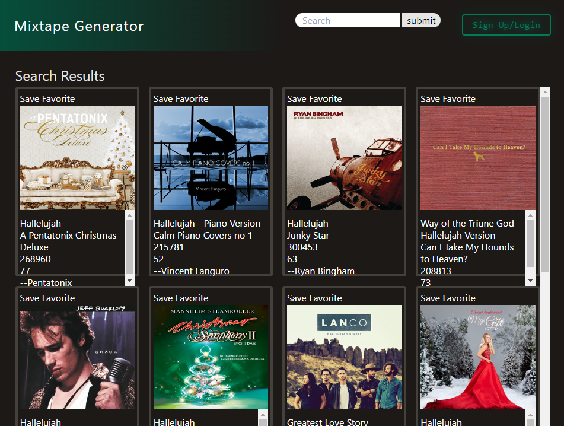

# Mixtape Generator

[](https://opensource.org/licenses/MIT)

## Description

- This application provides a location for a user to create an account and access a search function utilizing the Spotify API to construct a collection of favorite songs without requiring a Spotify account.

## Technologies

- [Heroku](https://www.heroku.com/)
- [Node.js](https://nodejs.org/)
- [MySQL](https://www.mysql.com/)
- [tailwindcss](https://tailwindcss.com/)
- [spotify-web-api-node](https://www.npmjs.com/package/spotify-web-api-node)

## Table of Contents

- [Installation](#installation)
- [Usage](#usage)
- [Bugs](#bugs)
- [License](#license)
- [Contributing](#contributing)
- [Questions](#questions)

## Installation

This application is deployed using Heroku.

In order to deploy this application without Heroku, Node.js is required for installation, and MySQL is required for database management.

From the base folder, on the command line:
```
npm i
```
should be run to guarantee all application dependencies are installed via Node.
```
npm run build
```
should be run in order to build tailwindcss dependencies.
```
npm run watch
```
can be run to build tailwindcss dependencies and watch them while the application runs.
```
mysql -u <MySQL username> <'-p' can be added if you have a password enabled on your MySQL username> <./db/schema.sql
```
The above command should look something like this:
```
mysql -u philj -p <./db/schema.sql
```
and this should populate your MySQL with the required database.

Take a look at the .env.EXAMPLE and create a .env file based on it. It should look something like this:



If you would like the application to be seeded with an example account, you can run the seeds with the command:
```
npm run seed
```
and you can utilize the test account:
```
name: test
email: test@test.com
password: testtest
```
and this account will be populated with a couple of example songs.

To run the application, now you can enter in the command line:
```
npm run start
```
and you can navigate to
```
localhost:3001
```
in your browser.

## Usage

Upon navigating in your browser of choice to
```
localhost:3001
```
you should be met with a website that looks like this:


When you select "Sign Up/Login" in the upper right hand corner, you should be met with this:



After either creating an account, or logging in, you should be met with this:


Utilizing the search bar at the top, you can search for any song by title (in this example "Hallelujah"), you should be met with this:



Selecting "Save Favorite" should move the selected song into your account list. And the song in your account list should have links to the song on Spotify.

## Bugs

- "Delete from Favorites" currently does not work.

## License

- [MIT License](https://opensource.org/licenses/MIT)

## Contributing

The creators can be contacted via their GitHub profiles.

## Questions

- [Ben](https://www.github.com/Hostile131)
- [Christian](https://github.com/seejayee)
- [Darren](https://github.com/dmilleza)
- [Ghazala](https://github.com/ghazalaahmed)